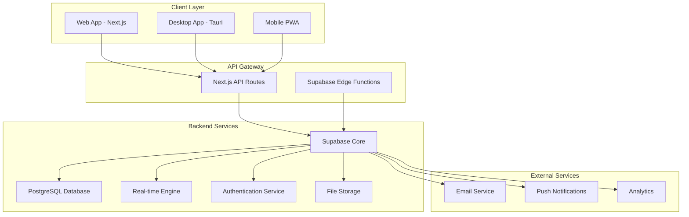
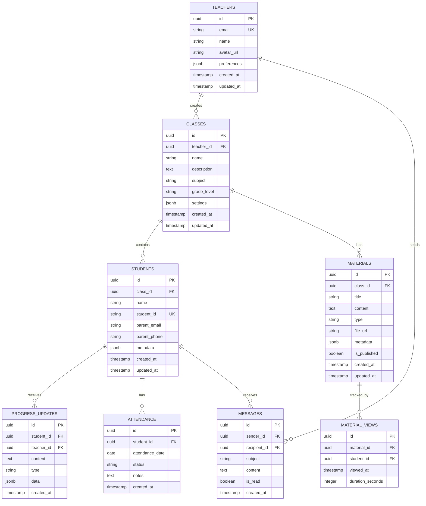
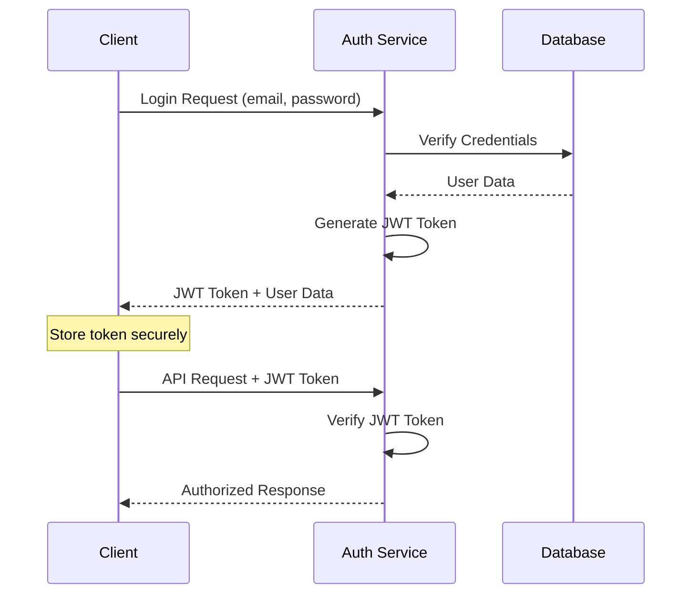

# 🏗️ EduConnect - Technical Blueprint

## 📋 Table of Contents

1. [System Architecture](#system-architecture)
2. [Database Design](#database-design)
3. [API Specifications](#api-specifications)
4. [Frontend Architecture](#frontend-architecture)
5. [Desktop Application](#desktop-application)
6. [Security Implementation](#security-implementation)
7. [Deployment Strategy](#deployment-strategy)
8. [Development Workflow](#development-workflow)

---

## 🏛️ System Architecture

### High-Level Architecture



### Component Architecture

```
educonnect/
├── apps/
│   ├── web/                    # Next.js web application
│   └── desktop/                # Tauri desktop application
├── packages/
│   ├── ui/                     # Shared UI components
│   ├── database/               # Database schema and types
│   ├── auth/                   # Authentication utilities
│   └── shared/                 # Shared utilities and types
├── docs/                       # Documentation
└── tools/                      # Build and development tools
```

---

## 🗄️ Database Design

### Entity Relationship Diagram



### Database Schema (SQL)

```sql
-- Enable necessary extensions
CREATE EXTENSION IF NOT EXISTS "uuid-ossp";
CREATE EXTENSION IF NOT EXISTS "pg_stat_statements";

-- Teachers table
CREATE TABLE teachers (
    id UUID PRIMARY KEY DEFAULT uuid_generate_v4(),
    email VARCHAR(255) UNIQUE NOT NULL,
    name VARCHAR(255) NOT NULL,
    avatar_url TEXT,
    preferences JSONB DEFAULT '{}',
    created_at TIMESTAMP WITH TIME ZONE DEFAULT NOW(),
    updated_at TIMESTAMP WITH TIME ZONE DEFAULT NOW()
);

-- Classes table
CREATE TABLE classes (
    id UUID PRIMARY KEY DEFAULT uuid_generate_v4(),
    teacher_id UUID NOT NULL REFERENCES teachers(id) ON DELETE CASCADE,
    name VARCHAR(255) NOT NULL,
    description TEXT,
    subject VARCHAR(100),
    grade_level VARCHAR(50),
    settings JSONB DEFAULT '{}',
    created_at TIMESTAMP WITH TIME ZONE DEFAULT NOW(),
    updated_at TIMESTAMP WITH TIME ZONE DEFAULT NOW()
);

-- Students table
CREATE TABLE students (
    id UUID PRIMARY KEY DEFAULT uuid_generate_v4(),
    class_id UUID NOT NULL REFERENCES classes(id) ON DELETE CASCADE,
    name VARCHAR(255) NOT NULL,
    student_id VARCHAR(100) UNIQUE,
    parent_email VARCHAR(255),
    parent_phone VARCHAR(50),
    metadata JSONB DEFAULT '{}',
    created_at TIMESTAMP WITH TIME ZONE DEFAULT NOW(),
    updated_at TIMESTAMP WITH TIME ZONE DEFAULT NOW()
);

-- Materials table
CREATE TABLE materials (
    id UUID PRIMARY KEY DEFAULT uuid_generate_v4(),
    class_id UUID NOT NULL REFERENCES classes(id) ON DELETE CASCADE,
    title VARCHAR(255) NOT NULL,
    content TEXT,
    type VARCHAR(50) DEFAULT 'document',
    file_url TEXT,
    metadata JSONB DEFAULT '{}',
    is_published BOOLEAN DEFAULT false,
    created_at TIMESTAMP WITH TIME ZONE DEFAULT NOW(),
    updated_at TIMESTAMP WITH TIME ZONE DEFAULT NOW()
);

-- Progress updates table
CREATE TABLE progress_updates (
    id UUID PRIMARY KEY DEFAULT uuid_generate_v4(),
    student_id UUID NOT NULL REFERENCES students(id) ON DELETE CASCADE,
    teacher_id UUID NOT NULL REFERENCES teachers(id) ON DELETE CASCADE,
    content TEXT NOT NULL,
    type VARCHAR(50) DEFAULT 'general',
    data JSONB DEFAULT '{}',
    created_at TIMESTAMP WITH TIME ZONE DEFAULT NOW()
);

-- Messages table
CREATE TABLE messages (
    id UUID PRIMARY KEY DEFAULT uuid_generate_v4(),
    sender_id UUID NOT NULL REFERENCES teachers(id) ON DELETE CASCADE,
    recipient_id UUID NOT NULL,
    subject VARCHAR(255),
    content TEXT NOT NULL,
    is_read BOOLEAN DEFAULT false,
    created_at TIMESTAMP WITH TIME ZONE DEFAULT NOW()
);

-- Attendance table
CREATE TABLE attendance (
    id UUID PRIMARY KEY DEFAULT uuid_generate_v4(),
    student_id UUID NOT NULL REFERENCES students(id) ON DELETE CASCADE,
    attendance_date DATE NOT NULL,
    status VARCHAR(20) DEFAULT 'present',
    notes TEXT,
    created_at TIMESTAMP WITH TIME ZONE DEFAULT NOW(),
    UNIQUE(student_id, attendance_date)
);

-- Material views tracking
CREATE TABLE material_views (
    id UUID PRIMARY KEY DEFAULT uuid_generate_v4(),
    material_id UUID NOT NULL REFERENCES materials(id) ON DELETE CASCADE,
    student_id UUID NOT NULL REFERENCES students(id) ON DELETE CASCADE,
    viewed_at TIMESTAMP WITH TIME ZONE DEFAULT NOW(),
    duration_seconds INTEGER DEFAULT 0
);

-- Indexes for performance
CREATE INDEX idx_classes_teacher_id ON classes(teacher_id);
CREATE INDEX idx_students_class_id ON students(class_id);
CREATE INDEX idx_materials_class_id ON materials(class_id);
CREATE INDEX idx_progress_updates_student_id ON progress_updates(student_id);
CREATE INDEX idx_messages_recipient_id ON messages(recipient_id);
CREATE INDEX idx_attendance_student_date ON attendance(student_id, attendance_date);

-- Row Level Security (RLS) Policies
ALTER TABLE teachers ENABLE ROW LEVEL SECURITY;
ALTER TABLE classes ENABLE ROW LEVEL SECURITY;
ALTER TABLE students ENABLE ROW LEVEL SECURITY;
ALTER TABLE materials ENABLE ROW LEVEL SECURITY;
ALTER TABLE progress_updates ENABLE ROW LEVEL SECURITY;
ALTER TABLE messages ENABLE ROW LEVEL SECURITY;
ALTER TABLE attendance ENABLE ROW LEVEL SECURITY;
ALTER TABLE material_views ENABLE ROW LEVEL SECURITY;

-- RLS Policies
CREATE POLICY "Teachers can manage their own data" ON teachers
    FOR ALL USING (auth.uid() = id);

CREATE POLICY "Teachers can manage their classes" ON classes
    FOR ALL USING (auth.uid() = teacher_id);

CREATE POLICY "Teachers can manage students in their classes" ON students
    FOR ALL USING (
        EXISTS (
            SELECT 1 FROM classes 
            WHERE classes.id = students.class_id 
            AND classes.teacher_id = auth.uid()
        )
    );

-- Similar policies for other tables...
```

---

## 🔌 API Specifications

### REST API Endpoints

#### Authentication
```typescript
POST /api/auth/login
POST /api/auth/logout
POST /api/auth/refresh
GET  /api/auth/me
```

#### Classes Management
```typescript
GET    /api/classes                    # List user's classes
POST   /api/classes                    # Create new class
GET    /api/classes/:id                # Get class details
PUT    /api/classes/:id                # Update class
DELETE /api/classes/:id                # Delete class
GET    /api/classes/:id/students       # List class students
GET    /api/classes/:id/materials      # List class materials
GET    /api/classes/:id/analytics      # Class analytics
```

#### Students Management
```typescript
GET    /api/students                   # List all students
POST   /api/students                   # Add new student
GET    /api/students/:id               # Get student details
PUT    /api/students/:id               # Update student
DELETE /api/students/:id               # Remove student
GET    /api/students/:id/progress      # Student progress history
POST   /api/students/:id/progress      # Add progress update
GET    /api/students/:id/attendance    # Student attendance
POST   /api/students/:id/attendance    # Record attendance
```

#### Materials Management
```typescript
GET    /api/materials                  # List materials
POST   /api/materials                  # Upload new material
GET    /api/materials/:id              # Get material details
PUT    /api/materials/:id              # Update material
DELETE /api/materials/:id              # Delete material
POST   /api/materials/:id/publish      # Publish material
GET    /api/materials/:id/analytics    # Material analytics
```

#### Communication
```typescript
GET    /api/messages                   # List messages
POST   /api/messages                   # Send message
GET    /api/messages/:id               # Get message
PUT    /api/messages/:id/read          # Mark as read
DELETE /api/messages/:id               # Delete message
```

### API Response Format

```typescript
// Success Response
interface ApiResponse<T> {
  success: true;
  data: T;
  message?: string;
  meta?: {
    total?: number;
    page?: number;
    limit?: number;
  };
}

// Error Response
interface ApiError {
  success: false;
  error: {
    code: string;
    message: string;
    details?: any;
  };
}
```

---

## 🎨 Frontend Architecture

### Component Structure

```
src/
├── components/
│   ├── ui/                     # Base UI components
│   │   ├── button.tsx
│   │   ├── input.tsx
│   │   ├── modal.tsx
│   │   └── ...
│   ├── layout/                 # Layout components
│   │   ├── header.tsx
│   │   ├── sidebar.tsx
│   │   └── footer.tsx
│   ├── dashboard/              # Dashboard components
│   │   ├── overview-cards.tsx
│   │   ├── recent-activity.tsx
│   │   └── quick-actions.tsx
│   ├── classes/                # Class management
│   │   ├── class-list.tsx
│   │   ├── class-form.tsx
│   │   └── class-details.tsx
│   ├── students/               # Student management
│   │   ├── student-list.tsx
│   │   ├── student-form.tsx
│   │   ├── student-profile.tsx
│   │   └── progress-chart.tsx
│   └── materials/              # Material management
│       ├── material-list.tsx
│       ├── material-upload.tsx
│       └── material-viewer.tsx
├── pages/
│   ├── api/                    # API routes
│   ├── dashboard/
│   ├── classes/
│   ├── students/
│   ├── materials/
│   └── settings/
├── lib/
│   ├── supabase.ts            # Database client
│   ├── auth.ts                # Authentication
│   ├── utils.ts               # Utilities
│   └── validations.ts         # Form validations
├── stores/
│   ├── auth-store.ts          # Authentication state
│   ├── classes-store.ts       # Classes state
│   ├── students-store.ts      # Students state
│   └── ui-store.ts            # UI state
├── hooks/
│   ├── use-auth.ts            # Authentication hook
│   ├── use-classes.ts         # Classes data hook
│   └── use-students.ts        # Students data hook
└── types/
    ├── database.ts            # Database types
    ├── api.ts                 # API types
    └── index.ts               # General types
```

### State Management (Zustand)

```typescript
// stores/auth-store.ts
interface AuthState {
  user: User | null;
  isLoading: boolean;
  login: (email: string, password: string) => Promise<void>;
  logout: () => Promise<void>;
  refreshUser: () => Promise<void>;
}

export const useAuthStore = create<AuthState>((set, get) => ({
  user: null,
  isLoading: false,
  login: async (email, password) => {
    set({ isLoading: true });
    // Login implementation
  },
  logout: async () => {
    // Logout implementation
  },
  refreshUser: async () => {
    // Refresh user implementation
  },
}));
```

### Custom Hooks

```typescript
// hooks/use-classes.ts
export function useClasses() {
  const [classes, setClasses] = useState<Class[]>([]);
  const [isLoading, setIsLoading] = useState(true);
  const [error, setError] = useState<string | null>(null);

  const fetchClasses = useCallback(async () => {
    try {
      setIsLoading(true);
      const { data, error } = await supabase
        .from('classes')
        .select('*')
        .order('created_at', { ascending: false });
      
      if (error) throw error;
      setClasses(data || []);
    } catch (err) {
      setError(err.message);
    } finally {
      setIsLoading(false);
    }
  }, []);

  useEffect(() => {
    fetchClasses();
  }, [fetchClasses]);

  return {
    classes,
    isLoading,
    error,
    refetch: fetchClasses,
  };
}
```

---

## 🖥️ Desktop Application

### Tauri Configuration

```json
// src-tauri/tauri.conf.json
{
  "build": {
    "beforeBuildCommand": "npm run build",
    "beforeDevCommand": "npm run dev",
    "devPath": "http://localhost:3000",
    "distDir": "../out"
  },
  "package": {
    "productName": "EduConnect",
    "version": "1.0.0"
  },
  "tauri": {
    "allowlist": {
      "all": false,
      "shell": {
        "all": false,
        "open": true
      },
      "dialog": {
        "all": false,
        "open": true,
        "save": true
      },
      "fs": {
        "all": false,
        "readFile": true,
        "writeFile": true,
        "createDir": true,
        "removeFile": true,
        "exists": true
      },
      "notification": {
        "all": true
      },
      "window": {
        "all": false,
        "close": true,
        "hide": true,
        "show": true,
        "maximize": true,
        "minimize": true,
        "unmaximize": true,
        "unminimize": true,
        "startDragging": true
      }
    },
    "bundle": {
      "active": true,
      "category": "Education",
      "copyright": "",
      "deb": {
        "depends": []
      },
      "externalBin": [],
      "icon": [
        "icons/32x32.png",
        "icons/128x128.png",
        "icons/128x128@2x.png",
        "icons/icon.icns",
        "icons/icon.ico"
      ],
      "identifier": "com.educonnect.app",
      "longDescription": "",
      "macOS": {
        "entitlements": null,
        "exceptionDomain": "",
        "frameworks": [],
        "providerShortName": null,
        "signingIdentity": null
      },
      "resources": [],
      "shortDescription": "",
      "targets": "all",
      "windows": {
        "certificateThumbprint": null,
        "digestAlgorithm": "sha256",
        "timestampUrl": ""
      }
    },
    "security": {
      "csp": null
    },
    "updater": {
      "active": true,
      "endpoints": [
        "https://releases.educonnect.dev/{{target}}/{{current_version}}"
      ],
      "dialog": true,
      "pubkey": "YOUR_PUBLIC_KEY_HERE"
    },
    "windows": [
      {
        "fullscreen": false,
        "height": 800,
        "resizable": true,
        "title": "EduConnect",
        "width": 1200,
        "minWidth": 800,
        "minHeight": 600
      }
    ]
  }
}
```

### Desktop-Specific Features

```typescript
// lib/desktop.ts
import { invoke } from '@tauri-apps/api/tauri';
import { sendNotification } from '@tauri-apps/api/notification';
import { save, open } from '@tauri-apps/api/dialog';

export class DesktopService {
  static async showNotification(title: string, body: string) {
    if (typeof window !== 'undefined' && window.__TAURI__) {
      await sendNotification({ title, body });
    }
  }

  static async saveFile(content: string, filename: string) {
    if (typeof window !== 'undefined' && window.__TAURI__) {
      const filePath = await save({
        defaultPath: filename,
        filters: [{
          name: 'Text Files',
          extensions: ['txt', 'md']
        }]
      });
      
      if (filePath) {
        await invoke('write_file', { path: filePath, content });
      }
    }
  }

  static async openFile() {
    if (typeof window !== 'undefined' && window.__TAURI__) {
      const selected = await open({
        multiple: false,
        filters: [{
          name: 'Documents',
          extensions: ['pdf', 'doc', 'docx', 'txt']
        }]
      });
      
      return selected;
    }
  }

  static isDesktop() {
    return typeof window !== 'undefined' && window.__TAURI__;
  }
}
```

---

## 🔒 Security Implementation

### Authentication Flow



### Security Measures

```typescript
// lib/security.ts
export class SecurityService {
  // Input sanitization
  static sanitizeInput(input: string): string {
    return input
      .replace(/<script\b[^<]*(?:(?!<\/script>)<[^<]*)*<\/script>/gi, '')
      .replace(/javascript:/gi, '')
      .trim();
  }

  // Rate limiting
  static rateLimiter = new Map<string, number[]>();
  
  static checkRateLimit(identifier: string, maxRequests = 10, windowMs = 60000): boolean {
    const now = Date.now();
    const requests = this.rateLimiter.get(identifier) || [];
    
    // Remove old requests outside the window
    const validRequests = requests.filter(time => now - time < windowMs);
    
    if (validRequests.length >= maxRequests) {
      return false;
    }
    
    validRequests.push(now);
    this.rateLimiter.set(identifier, validRequests);
    return true;
  }

  // CSRF protection
  static generateCSRFToken(): string {
    return crypto.randomUUID();
  }

  // Content Security Policy
  static getCSPHeader(): string {
    return [
      "default-src 'self'",
      "script-src 'self' 'unsafe-inline' 'unsafe-eval'",
      "style-src 'self' 'unsafe-inline'",
      "img-src 'self' data: https:",
      "font-src 'self'",
      "connect-src 'self' https://*.supabase.co wss://*.supabase.co",
      "frame-ancestors 'none'",
      "base-uri 'self'",
      "form-action 'self'"
    ].join('; ');
  }
}
```

### Data Encryption

```typescript
// lib/encryption.ts
import CryptoJS from 'crypto-js';

export class EncryptionService {
  private static readonly SECRET_KEY = process.env.ENCRYPTION_KEY!;

  static encrypt(text: string): string {
    return CryptoJS.AES.encrypt(text, this.SECRET_KEY).toString();
  }

  static decrypt(ciphertext: string): string {
    const bytes = CryptoJS.AES.decrypt(ciphertext, this.SECRET_KEY);
    return bytes.toString(CryptoJS.enc.Utf8);
  }

  static hashPassword(password: string): string {
    return CryptoJS.SHA256(password + process.env.SALT).toString();
  }
}
```

---

## 🚀 Deployment Strategy

### CI/CD Pipeline

```yaml
# .github/workflows/deploy.yml
name: Deploy EduConnect

on:
  push:
    branches: [main]
  pull_request:
    branches: [main]

jobs:
  test:
    runs-on: ubuntu-latest
    steps:
      - uses: actions/checkout@v3
      - uses: actions/setup-node@v3
        with:
          node-version: '18'
      - run: npm ci
      - run: npm run test
      - run: npm run lint
      - run: npm run type-check

  deploy-web:
    needs: test
    runs-on: ubuntu-latest
    if: github.ref == 'refs/heads/main'
    steps:
      - uses: actions/checkout@v3
      - uses: actions/setup-node@v3
        with:
          node-version: '18'
      - run: npm ci
      - run: npm run build
      - uses: amondnet/vercel-action@v20
        with:
          vercel-token: ${{ secrets.VERCEL_TOKEN }}
          vercel-org-id: ${{ secrets.ORG_ID }}
          vercel-project-id: ${{ secrets.PROJECT_ID }}

  build-desktop:
    needs: test
    strategy:
      matrix:
        platform: [macos-latest, ubuntu-latest, windows-latest]
    runs-on: ${{ matrix.platform }}
    steps:
      - uses: actions/checkout@v3
      - uses: actions/setup-node@v3
        with:
          node-version: '18'
      - uses: dtolnay/rust-toolchain@stable
      - run: npm ci
      - run: npm run tauri:build
      - uses: actions/upload-artifact@v3
        with:
          name: desktop-${{ matrix.platform }}
          path: src-tauri/target/release/bundle/
```

### Environment Configuration

```bash
# .env.example
# Supabase Configuration
NEXT_PUBLIC_SUPABASE_URL=your_supabase_url
NEXT_PUBLIC_SUPABASE_ANON_KEY=your_supabase_anon_key
SUPABASE_SERVICE_ROLE_KEY=your_service_role_key

# Authentication
NEXTAUTH_URL=http://localhost:3000
NEXTAUTH_SECRET=your_nextauth_secret

# Security
ENCRYPTION_KEY=your_encryption_key
SALT=your_salt_value

# Email Service
SMTP_HOST=smtp.gmail.com
SMTP_PORT=587
SMTP_USER=your_email
SMTP_PASS=your_password

# Analytics (Optional)
NEXT_PUBLIC_ANALYTICS_ID=your_analytics_id

# Feature Flags
NEXT_PUBLIC_ENABLE_DESKTOP=true
NEXT_PUBLIC_ENABLE_OFFLINE=true
```

### Monitoring & Logging

```typescript
// lib/monitoring.ts
export class MonitoringService {
  static logError(error: Error, context?: any) {
    console.error('Application Error:', {
      message: error.message,
      stack: error.stack,
      context,
      timestamp: new Date().toISOString(),
      userAgent: typeof window !== 'undefined' ? window.navigator.userAgent : 'server',
    });

    // Send to monitoring service in production
    if (process.env.NODE_ENV === 'production') {
      // Integration with monitoring service
    }
  }

  static logPerformance(metric: string, value: number, tags?: Record<string, string>) {
    console.log('Performance Metric:', {
      metric,
      value,
      tags,
      timestamp: new Date().toISOString(),
    });
  }

  static trackUserAction(action: string, properties?: Record<string, any>) {
    console.log('User Action:', {
      action,
      properties,
      timestamp: new Date().toISOString(),
    });
  }
}
```

---

## 🔄 Development Workflow

### Git Workflow

```
main
├── develop
│   ├── feature/user-authentication
│   ├── feature/class-management
│   └── feature/student-progress
├── hotfix/critical-bug-fix
└── release/v1.0.0
```

### Code Quality Tools

```json
// .eslintrc.json
{
  "extends": [
    "next/core-web-vitals",
    "@typescript-eslint/recommended",
    "prettier"
  ],
  "rules": {
    "@typescript-eslint/no-unused-vars": "error",
    "@typescript-eslint/no-explicit-any": "warn",
    "prefer-const": "error",
    "no-console": "warn"
  }
}
```

```json
// prettier.config.js
module.exports = {
  semi: true,
  trailingComma: 'es5',
  singleQuote: true,
  printWidth: 80,
  tabWidth: 2,
  useTabs: false,
};
```

### Testing Strategy

```typescript
// __tests__/components/ClassList.test.tsx
import { render, screen } from '@testing-library/react';
import { ClassList } from '@/components/classes/class-list';

describe('ClassList', () => {
  it('renders class list correctly', () => {
    const mockClasses = [
      { id: '1', name: 'Math 101', description: 'Basic Mathematics' },
      { id: '2', name: 'English 101', description: 'Basic English' },
    ];

    render(<ClassList classes={mockClasses} />);
    
    expect(screen.getByText('Math 101')).toBeInTheDocument();
    expect(screen.getByText('English 101')).toBeInTheDocument();
  });
});
```

### Performance Optimization

```typescript
// lib/performance.ts
export class PerformanceService {
  static measurePageLoad() {
    if (typeof window !== 'undefined') {
      window.addEventListener('load', () => {
        const navigation = performance.getEntriesByType('navigation')[0] as PerformanceNavigationTiming;
        const loadTime = navigation.loadEventEnd - navigation.loadEventStart;
        
        MonitoringService.logPerformance('page_load_time', loadTime);
      });
    }
  }

  static lazy<T extends React.ComponentType<any>>(
    importFunc: () => Promise<{ default: T }>
  ) {
    return React.lazy(importFunc);
  }

  static debounce<T extends (...args: any[]) => any>(
    func: T,
    wait: number
  ): (...args: Parameters<T>) => void {
    let timeout: NodeJS.Timeout;
    return (...args: Parameters<T>) => {
      clearTimeout(timeout);
      timeout = setTimeout(() => func(...args), wait);
    };
  }
}
```

---

This blueprint provides a comprehensive technical foundation for building EduConnect. Each section can be expanded with more specific implementation details as development progresses.