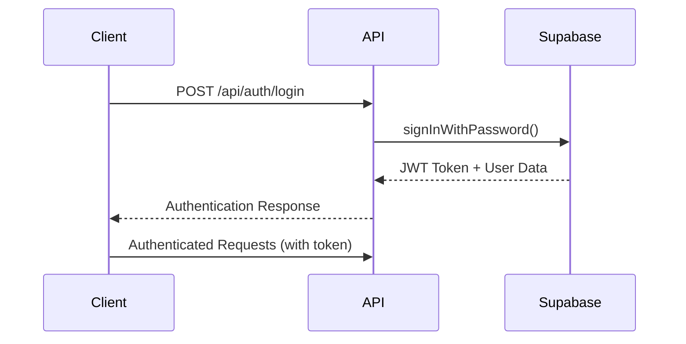

# 🔐 Authentication API

Complete reference for EduConnect authentication endpoints and flows.

## 🎯 Overview

EduConnect uses Supabase Auth for secure user authentication with JWT tokens. All API endpoints require proper authentication except for login and public routes.

## 🔑 Authentication Flow



## 📡 API Endpoints

### Login
Authenticate user with email and password.

**Endpoint**: `POST /api/auth/login`

**Request Body**:
```json
{
  "email": "teacher@school.edu",
  "password": "password"
}
```

**Response** (Success - 200):
```json
{
  "user": {
    "id": "uuid",
    "email": "teacher@school.edu",
    "created_at": "2024-01-01T00:00:00Z"
  },
  "session": {
    "access_token": "jwt-token",
    "refresh_token": "refresh-token",
    "expires_at": 1234567890
  },
  "teacher": {
    "id": "uuid",
    "name": "John Teacher",
    "email": "teacher@school.edu",
    "avatar_url": null,
    "preferences": {}
  }
}
```

**Response** (Error - 401):
```json
{
  "error": "Invalid credentials",
  "message": "Email or password is incorrect"
}
```

### Logout
Sign out current user and invalidate session.

**Endpoint**: `POST /api/auth/logout`

**Headers**:
```
Authorization: Bearer <jwt-token>
```

**Response** (Success - 200):
```json
{
  "message": "Logged out successfully"
}
```

### Get Current User
Retrieve current authenticated user information.

**Endpoint**: `GET /api/auth/me`

**Headers**:
```
Authorization: Bearer <jwt-token>
```

**Response** (Success - 200):
```json
{
  "user": {
    "id": "uuid",
    "email": "teacher@school.edu",
    "created_at": "2024-01-01T00:00:00Z"
  },
  "teacher": {
    "id": "uuid",
    "name": "John Teacher",
    "email": "teacher@school.edu",
    "avatar_url": null,
    "preferences": {}
  }
}
```

### Refresh Token
Refresh expired access token using refresh token.

**Endpoint**: `POST /api/auth/refresh`

**Request Body**:
```json
{
  "refresh_token": "refresh-token"
}
```

**Response** (Success - 200):
```json
{
  "access_token": "new-jwt-token",
  "refresh_token": "new-refresh-token",
  "expires_at": 1234567890
}
```

## 🔒 Client-Side Authentication

### Using Supabase Client

```typescript
import { supabase } from '@/lib/supabase-client'

// Login
const { data, error } = await supabase.auth.signInWithPassword({
  email: 'teacher@school.edu',
  password: 'password'
})

// Logout
await supabase.auth.signOut()

// Get current session
const { data: { session } } = await supabase.auth.getSession()

// Listen for auth changes
supabase.auth.onAuthStateChange((event, session) => {
  if (event === 'SIGNED_IN') {
    // User signed in
  } else if (event === 'SIGNED_OUT') {
    // User signed out
  }
})
```

### Using Zustand Store

```typescript
import { useAuthStore } from '@/stores/auth-store'

function LoginComponent() {
  const { signIn, signOut, user, isLoading } = useAuthStore()
  
  const handleLogin = async () => {
    try {
      await signIn('teacher@school.edu', 'password')
      // Redirect to dashboard
    } catch (error) {
      // Handle error
    }
  }
  
  return (
    <button onClick={handleLogin} disabled={isLoading}>
      {isLoading ? 'Signing in...' : 'Sign In'}
    </button>
  )
}
```

## 🛡️ Protected Routes

### Server-Side Protection

```typescript
// app/api/protected-route/route.ts
import { createServerComponentClient } from '@supabase/auth-helpers-nextjs'
import { cookies } from 'next/headers'

export async function GET() {
  const supabase = createServerComponentClient({ cookies })
  
  const { data: { session } } = await supabase.auth.getSession()
  
  if (!session) {
    return new Response('Unauthorized', { status: 401 })
  }
  
  // Continue with protected logic
}
```

### Client-Side Protection

```typescript
// components/ProtectedRoute.tsx
'use client'

import { useEffect } from 'react'
import { useRouter } from 'next/navigation'
import { useAuthStore } from '@/stores/auth-store'

export function ProtectedRoute({ children }: { children: React.ReactNode }) {
  const { user, isInitialized } = useAuthStore()
  const router = useRouter()
  
  useEffect(() => {
    if (isInitialized && !user) {
      router.push('/login')
    }
  }, [user, isInitialized, router])
  
  if (!isInitialized) {
    return <div>Loading...</div>
  }
  
  if (!user) {
    return null
  }
  
  return <>{children}</>
}
```

## 🔧 Error Handling

### Common Error Codes

| Code | Message | Description |
|------|---------|-------------|
| 400 | Bad Request | Invalid request format |
| 401 | Unauthorized | Invalid or missing credentials |
| 403 | Forbidden | Insufficient permissions |
| 422 | Validation Error | Invalid input data |
| 500 | Server Error | Internal server error |

### Error Response Format

```json
{
  "error": "error_code",
  "message": "Human readable error message",
  "details": {
    "field": "specific field error"
  }
}
```

### Handling Errors

```typescript
try {
  const response = await fetch('/api/auth/login', {
    method: 'POST',
    headers: { 'Content-Type': 'application/json' },
    body: JSON.stringify({ email, password })
  })
  
  if (!response.ok) {
    const error = await response.json()
    throw new Error(error.message)
  }
  
  const data = await response.json()
  // Handle success
} catch (error) {
  // Handle error
  console.error('Authentication failed:', error.message)
}
```

## 🔐 Security Best Practices

### Token Storage
- Store JWT tokens securely (httpOnly cookies preferred)
- Never store tokens in localStorage for production
- Implement automatic token refresh
- Clear tokens on logout

### Password Security
- Enforce strong password requirements
- Implement rate limiting for login attempts
- Use HTTPS for all authentication requests
- Hash passwords server-side (handled by Supabase)

### Session Management
- Set appropriate token expiration times
- Implement session timeout
- Validate tokens on each request
- Provide secure logout functionality

## 🧪 Testing Authentication

### Test Credentials
```
Email: teacher@school.edu
Password: password
```

### Manual Testing
1. **Login Test**:
   ```bash
   curl -X POST https://your-app.vercel.app/api/auth/login \
     -H "Content-Type: application/json" \
     -d '{"email":"teacher@school.edu","password":"password"}'
   ```

2. **Protected Route Test**:
   ```bash
   curl -X GET https://your-app.vercel.app/api/auth/me \
     -H "Authorization: Bearer <jwt-token>"
   ```

### Automated Testing
```typescript
// __tests__/auth.test.ts
describe('Authentication', () => {
  test('should login with valid credentials', async () => {
    const response = await fetch('/api/auth/login', {
      method: 'POST',
      headers: { 'Content-Type': 'application/json' },
      body: JSON.stringify({
        email: 'teacher@school.edu',
        password: 'password'
      })
    })
    
    expect(response.status).toBe(200)
    const data = await response.json()
    expect(data.user).toBeDefined()
    expect(data.session).toBeDefined()
  })
})
```

## 🔄 Migration & Updates

### Token Migration
When updating authentication systems:
1. Maintain backward compatibility
2. Provide migration endpoints
3. Update client-side code gradually
4. Monitor for authentication errors

### Version Compatibility
- API versioning for authentication endpoints
- Graceful degradation for older clients
- Clear deprecation notices
- Migration documentation

## 📚 Related Documentation

- **[User Guide - Login](../user-guide/Dashboard.md#first-login)**: User login instructions
- **[Development - State Management](../development/State-Management.md)**: Auth store implementation
- **[Troubleshooting - Login Issues](../troubleshooting/Login.md)**: Common login problems

**Secure authentication is the foundation of EduConnect! 🔐✨**