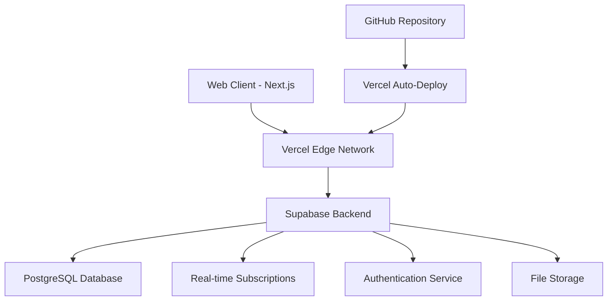

# 🏗️ Architecture Overview

EduConnect is built with modern web technologies for scalability, performance, and maintainability.

## 🎯 High-Level Architecture



## 🛠️ Technology Stack

### Frontend
- **Framework**: Next.js 14 with App Router
- **Language**: TypeScript (100% coverage)
- **Styling**: Tailwind CSS + Shadcn/ui
- **State Management**: Zustand
- **UI Components**: Radix UI primitives

### Backend
- **Database**: Supabase PostgreSQL
- **Authentication**: Supabase Auth (JWT)
- **Real-time**: Supabase subscriptions
- **File Storage**: Supabase Storage
- **API**: Next.js API routes

### Infrastructure
- **Hosting**: Vercel (Edge Network)
- **CI/CD**: GitHub integration
- **Environment**: Vercel environment variables
- **Monitoring**: Vercel Analytics

## 📁 Project Structure

```
educonnect/
├── app/                    # Next.js 14 app router
│   ├── layout.tsx         # Root layout
│   ├── page.tsx           # Home/login page
│   ├── globals.css        # Global styles
│   ├── dashboard/         # Dashboard pages
│   └── api/               # API routes
├── components/            # React components
│   ├── ui/               # Base UI components
│   ├── auth/             # Authentication
│   ├── layout/           # Layout components
│   └── dashboard/        # Feature components
├── lib/                  # Utilities
│   ├── supabase-client.ts # Database client
│   └── utils.ts          # Helper functions
├── stores/               # Zustand stores
├── hooks/                # Custom hooks
├── types/                # TypeScript definitions
├── database/             # SQL schemas
└── public/               # Static assets
```

## 🔄 Data Flow

### Authentication Flow
1. User submits login form
2. Supabase Auth validates credentials
3. JWT token returned and stored
4. Protected routes check token
5. User data fetched from database

### Component Data Flow
1. Components use Zustand stores
2. Stores call API routes
3. API routes query Supabase
4. Real-time updates via subscriptions
5. UI updates automatically

## 🗄️ Database Design

### Core Entities
- **Teachers**: User accounts and profiles
- **Classes**: Course/class information
- **Students**: Student profiles and enrollment
- **Materials**: Educational resources
- **Progress Updates**: Student progress tracking
- **Messages**: Communication system

### Relationships
```
Teachers (1) → (Many) Classes
Classes (1) → (Many) Students
Classes (1) → (Many) Materials
Students (1) → (Many) Progress Updates
Teachers (1) → (Many) Messages
```

## 🔐 Security Architecture

### Authentication
- JWT tokens with secure storage
- Row Level Security (RLS) policies
- Protected API routes
- Environment variable security

### Data Protection
- HTTPS encryption
- Input validation and sanitization
- SQL injection prevention
- XSS protection

## ⚡ Performance Architecture

### Frontend Optimization
- Next.js automatic code splitting
- Image optimization
- Static generation where possible
- Bundle size optimization (~400KB)

### Backend Optimization
- Database indexing
- Query optimization
- Connection pooling
- Edge caching

## 🔄 Development Workflow

### Local Development
```bash
npm run dev          # Development server
npm run type-check   # TypeScript validation
npm run lint         # Code quality
```

### Deployment Pipeline
```bash
git push origin main → Vercel Build → Production Deploy
```

### Quality Assurance
- TypeScript strict mode
- ESLint + Prettier
- Automated testing (planned)
- Performance monitoring

## 🚀 Scalability Considerations

### Current Capacity
- **Users**: Thousands (Supabase free tier)
- **Storage**: 500MB (Supabase free tier)
- **Bandwidth**: 2GB (Supabase free tier)
- **Functions**: 500K invocations (Vercel free tier)

### Scaling Strategy
- **Database**: Upgrade Supabase plan
- **Hosting**: Vercel Pro for higher limits
- **CDN**: Global edge distribution
- **Caching**: Redis for session storage

## 🔧 Configuration Management

### Environment Variables
```bash
# Supabase
NEXT_PUBLIC_SUPABASE_URL=
NEXT_PUBLIC_SUPABASE_ANON_KEY=
SUPABASE_SERVICE_ROLE_KEY=

# Application
NODE_ENV=production
```

### Build Configuration
- **Next.js**: Optimized for production
- **TypeScript**: Strict mode enabled
- **Tailwind**: Purged CSS for minimal size
- **Vercel**: Edge functions and ISR

## 📊 Monitoring & Analytics

### Performance Monitoring
- Vercel Web Vitals
- Lighthouse scores
- Core Web Vitals tracking
- Real User Monitoring (RUM)

### Error Tracking
- Next.js error boundaries
- Supabase error logging
- Vercel function logs
- Client-side error reporting

## 🔮 Future Architecture

### Planned Enhancements
- **Microservices**: Service separation
- **Caching**: Redis implementation
- **CDN**: Asset optimization
- **Mobile**: React Native apps
- **AI**: Machine learning integration

### Technology Roadmap
- **Database**: Potential multi-region
- **Authentication**: SSO integration
- **Real-time**: Enhanced WebSocket features
- **Analytics**: Advanced reporting
- **Automation**: Workflow engines

This architecture provides a solid foundation for current needs while maintaining flexibility for future growth and enhancements.